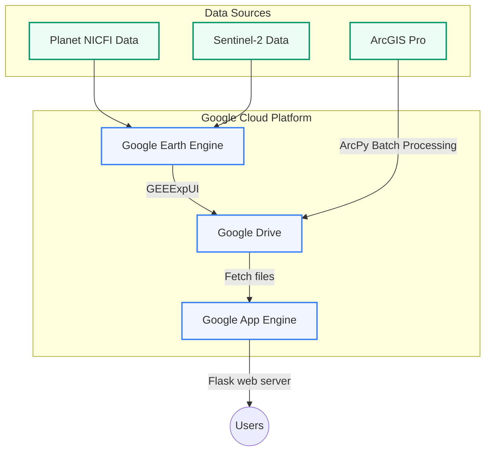

# DPportal
portal website on Google cloud App Engine

URL: https://stone-armor-430205-e2.uc.r.appspot.com/


## High Level Diagram




## Developing ToDo List
- [X] Support search by name of dumpsite ( auto-complete typing)
- [X] migrate all the jpeg files from OneDrive to Google Drive 
- [X] Monthly update of tif files collection functionality, both nicfi and sentinel
- [X] Map viewer functionality
- [X] Long term authentication for Google Drive API, limitation for user
- [X] UI and Description update, more readable and user-friendly


## Update Log
- 2024/11/13
    - update the statistics page time to be weekly update.
    - Performance each update task for history data ,from 2024/10 to 2020/10 of nicfi
    - update the tif export size function, update the rules for the export size.
        -  Size options for exporting images:
        -  1. For areas < 1 ha: Export a 3 ha square region centered on feature
        -  2. For areas 1-4 ha: Export a 5 ha square region centered on feature  
        -  3. For areas 4-10 ha: Export a region 3x the area centered on feature
        -  4. For areas >= 10 ha: Export using the actual feature bounds

- 2024/11/02
    - after tried the F1 instance, it still has the problem of the memory limit, exceed the 384, so switch back to F2


- 2024/10/30
    - add the new data statistics page, using the csv from google drive 
    - update the ui of home page and the footer to the statistics page


- 2024/10/23
    - add GUI for manual download tif files
    - add the new Cloud task feature with the cron job to perform the download task and statistics update

- 2024/10/17
    - add the mapview function conncet with the feature layer of the dumpsite, using the maps.arcgis.com to host the feature layer
    - using the Javascript sdk of Arcgis to load the mapview and the feature layer


- 2024/10/15
    - add new target index csv file( target rule: AREA_HA > 0.1 and 133 ), based on target index to perform the download task
    - add auto download the last month tif file to the drive, using the cron job of the google cloud scheduler


- 2024/10/14
    - New page for the static data
    - Daily update of the static data using the app engine cron job with google cloud scheduler

- 2024/9/20
    - alpha branch released online versionID: [20240812t152105](https://20240812t152105-dot-stone-armor-430205-e2.uc.r.appspot.com/)
    - add new alpha branch for a new Dev status, for showing the ready Version 
    - Collapsed the search results and make the search results more flexible 


- 2024/9/19
    - add the date lable for the result items 
    - revise the folder's name and description
    - add super link for the description


- 2024/9/18
    - add new dev branch for the UI and Map viewer
    - Update the UI, multiple column by folder and groups


- 2024/9/10
    - Test the update_log function, which will update the update_log.txt file.
    - reorder the target_folders in drive_utils.py, to shows the folder's order in correct way.


## Version 1.0 Features 
- Search for files in Google Drive, by the index number of dumpsite, and the name of dumpsite.
- Preview jpeg files, only jpeg files are supported.
- Download file, both jpeg and tif files are supported.
- Include the tif:sentinel(2024), nicfi(2024), jpeg: EsriworldImagery.
- Tif files size using two type, if small than 4ha, the size will be 50000 sq meters, if larger than 4ha, the size will be 200000 sq meters.


## Deployment Instructions

### Google Cloud setup

1. Create a new project in Google Cloud Console
2. Enable the App Engine API for the project
3. Google Drive API setup 
4. Enable the Google Drive API for the project
5. Create a service account, and download the JSON key file
6. Seeting the Permissions for the service account to access the Google Drive and Google Earth Engine.      
7. Set the environment variable `GOOGLE_APPLICATION_CREDENTIALS` to the path of the JSON key file
8. Hide the JSON key file by adding it to .gitignore (google_drive_credentials.json)
9. Enable the Cloud Scheduler API for the projects, seeting in the Cloud Scheduler UI
10. Non-commericial use of the Earth Engine is free, [earth engine](https://earthengine.google.com/noncommercial/)
11. Register a New Earth Engine project, and add it to current app engine project [add EE project](https://code.earthengine.google.com/register)
12. Access the nicfi data on EE, [nicfi](https://developers.planet.com/docs/integrations/gee/nicfi/), set the service account in the nicfi data access permission page.
13. Cloud console IAM & Admin, add the Earth Engine Resource Admin role to the service account.

### Deployment
1. Install the requirements

```
pip install -r requirements.txt
```

2. Deploy the app

After updating the code, deploy the app:
```
gcloud app deploy
```

3. Deploied app versions list command
```
gcloud app versions list
```

4. Deploy the specific version
```

gcloud app deploy --promote --version=YOUR_VERSION_ID
```

5. Deploy the cron.yaml file
```
gcloud app deploy cron.yaml
```

Monitor the app's logs:
```
gcloud app logs tail -s default
```

Monitor the app's Logs on certain version
```
gcloud app logs tail -s default --version=YOUR_VERSION_ID
```


Deploy cron.yaml (manual update the schedule time and task)
```
gcloud app deploy cron.yaml
```